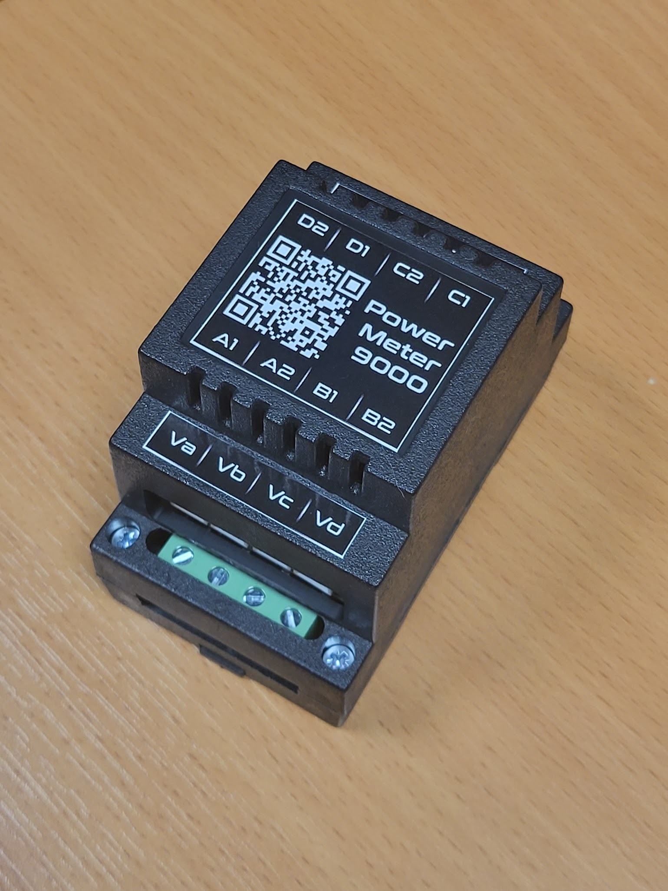

# What is power meter 9000?

Power Meter 9000 is a device to measure power drawn by electrical devices in your house. It can measure up to 8 current channels, each with 20 A current capability.

# Architecture

Power meter 9000 consists of 4 measurement channels (A, B, C, D), each with 1 voltage measurement and 2 current/power channels (total of 8 power measurements). Each channel uses BL0939 IC.

To get correct active power measurements, the current channel needs to be connected to the same phase as the corresponding voltage channels.

For example, if you have dishwasher on L1 phase, TV on L1, homelab on L2 and PC on L3 you should connect:
 - L1 to Va
 - L2 to Vb
 - L3 to Vc
 - dishwasher clamp to A1
 - TV clamp to A2
 - homelab clamp to B1
 - homelab clamp to C1

Device is supplied by integraded AC-DC power supply, with power input on channel Va.

ESP32-S2 is a brain of the power meter, running esphome. Schematics/PCBs are in the repo.

# How to connect it?

 - decide on the power lines you want to measure
 - connect neutral to top terminal (both are parallel)
 - for each power line, find the corresponding phase it belongs to (L1, L2, L3)
 - connect voltage inputs to corresponding terminals (Va, Vb, Vc, Vd)
 - install current clamps on the measurement lines
 - connect clamps to corresponding current input lines

# Software

Device has [`power-meter-9000.yaml`](esphome/power-meter-9000.yaml) flashed by default.

This means that the device has captive portal by default with its WiFi in AP mode.

To change WiFi credentials and connect to home assistant:
 - power on the device
 - connect to the WiFi of the device (`power-meter-9000` with password `power-meter-9000`)
 - change WiFi credentials
 - device should be discovered in Home Assistant

# But I want to flash it normally!

Sure, just disconnect it from mains, undo 4 screws and connect USB to the ESP32 module. To start in bootloader, press user button during reset.

You can use https://adafruit.github.io/Adafruit_WebSerial_ESPTool/ or just esphome command line tool.

# FAQ

## My device reset itself and just don't appear on WiFi

Have you re-flashed your device?

Due to the bug in the ESP32S2 modules, WiFi power needs to be brought down to around 8.5 - 11 - 15 dBm for stable operation (varies on the specific copy and WiFi coverage).

If you still have problems, turn the output power down.

## Weak wifi signal in electrical cabinet

By default, output_power of wifi is set to 11 dBm. If you have weak wifi, you may try increasing output_power to 15 dBm and see if that would help.

## I get correct reading of current, but my power is off

Have you connected properly current clamp to the same phase as the corresponding voltage input?
